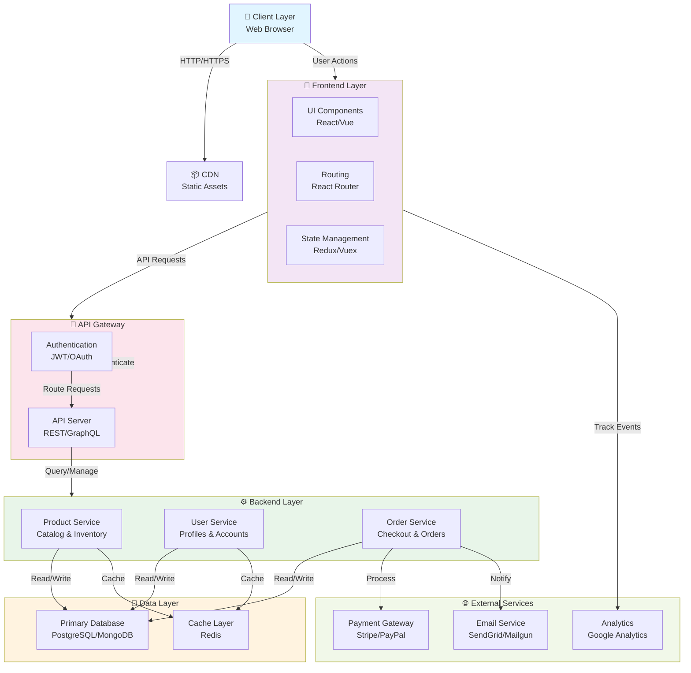

# Fashion-Hub Architecture Overview

This document outlines the high-level architecture of the Fashion-Hub project.

## System Architecture

## Component Breakdown

### Client Layer
- **Web Browser**: User interface accessed through modern web browsers
- **Responsive Design**: Mobile, tablet, and desktop support

### Frontend Layer
- **UI Components**: Reusable component library
- **Routing**: Client-side navigation between pages
- **State Management**: Centralized state for application data

### API Gateway
- **Authentication**: Secure user authentication with JWT or OAuth tokens
- **API Server**: RESTful or GraphQL API endpoints

### Backend Layer
- **Product Service**: Manages fashion product catalog and inventory
- **User Service**: Handles user profiles, accounts, and preferences
- **Order Service**: Processes orders, payments, and shipments

### Data Layer
- **Primary Database**: Main data storage for all business data
- **Cache Layer**: Redis for performance optimization and session management

### External Services
- **Payment Gateway**: Secure payment processing
- **Email Service**: Transactional and marketing emails
- **Analytics**: User behavior and traffic analytics

## Data Flow

1. **User Access**: Client initiates HTTP request to access the application
2. **Authentication**: API Gateway validates user credentials
3. **Request Processing**: Backend services handle business logic
4. **Database Operations**: Services query or update the database
5. **Caching**: Frequently accessed data is cached for performance
6. **Response**: Processed data returned to frontend
7. **Rendering**: Frontend renders the updated UI

## Technology Stack (Typical)

- **Frontend**: React/Vue.js, TypeScript, Tailwind CSS
- **Backend**: Node.js/Python/Java, Express/Django/Spring
- **Database**: PostgreSQL/MongoDB
- **Cache**: Redis
- **Deployment**: Docker, Kubernetes (optional)
- **CI/CD**: GitHub Actions, GitLab CI

---

*Last Updated: 2026-05-25*
